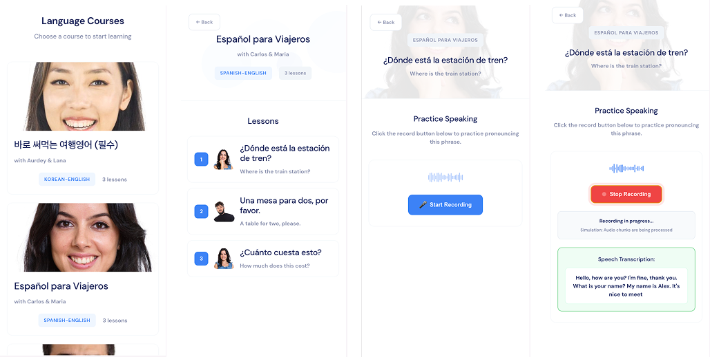

# Language Learning Portal

## Project Overview

📄 [__Google-inspired Design Doc__](https://docs.google.com/document/d/1y6X6ODpkvbQFJUUszwvpGaulPQ1m4Fh1rdWhxVu-QAQ/edit?usp=sharing) 

Miniature language learning portal: a simple web application where users can browse courses, view lessons, and simulate recording/transcribing speech for a lesson.

This project is a proof of concept for a language learning mobile application with voice recording functionality inspired by [Speak](https://www.speak.com/). The recording experinece simulates real-time transcription by sending audio cheunks to the backend via WebSocket. The web app is designed to support only mobile viewports.

Visit the __Design Doc__ for the high-level and detailed designs, challenges + resolution, plans for scaling, and future features & improvements!



#### Teck Stack

React, CSS, Express/Node.js, WebSocket (ws library)

## Running the Application Locally

### Prerequisites

- Node.js (version 14 or higher)
- npm (comes with Node.js)

### Setup Instructions

1. **Clone the repository** (if not already done):
   ```bash
   git clone https://github.com/Meron-b/speak-portal.git
   cd full-stack-take-home-assessment
   ```

2. **Install server dependencies**:
   ```bash
   cd server
   npm install
   ```

3. **Install client dependencies**:
   ```bash
   cd ../client
   npm install
   ```

### Running the Application

The application consists of two parts that need to be run simultaneously:

1. **Start the backend server** (from the `server` directory):
   ```bash
   cd server
   npm start
   ```
   - Server will run on `http://localhost:3001`
   - WebSocket server will be available at `ws://localhost:3001`
   - API endpoints will be available at `http://localhost:3001/api`

2. **Start the frontend client** (from the `client` directory, in a new terminal):
   ```bash
   cd client
   npm start
   ```
   - Client will run on `http://localhost:3000`
   - Browser should automatically open to the application

### Accessing the Application

Once both servers are running:
- Open your browser to `http://localhost:3000`
- The application will display a list of available courses
- Navigate through courses and lessons to test the recording functionality
